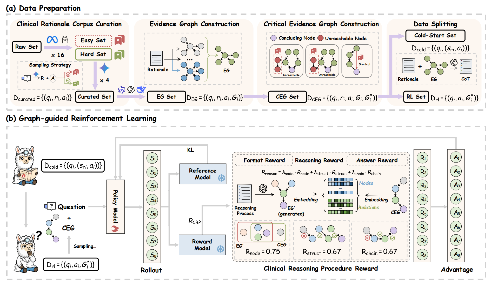
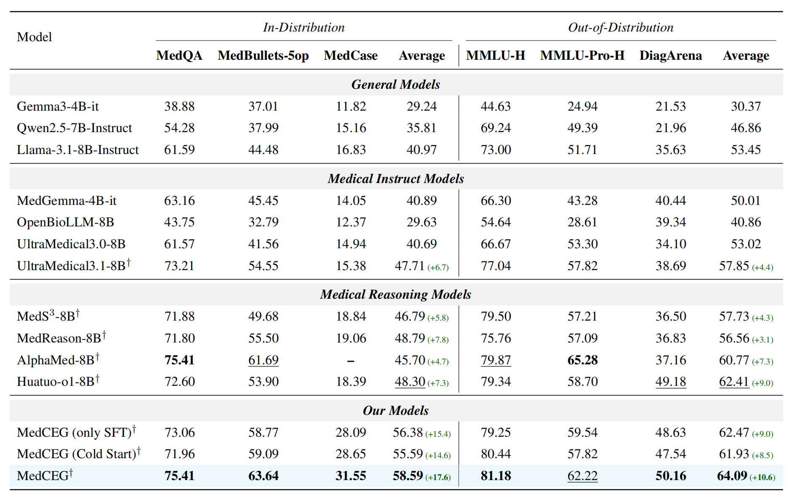
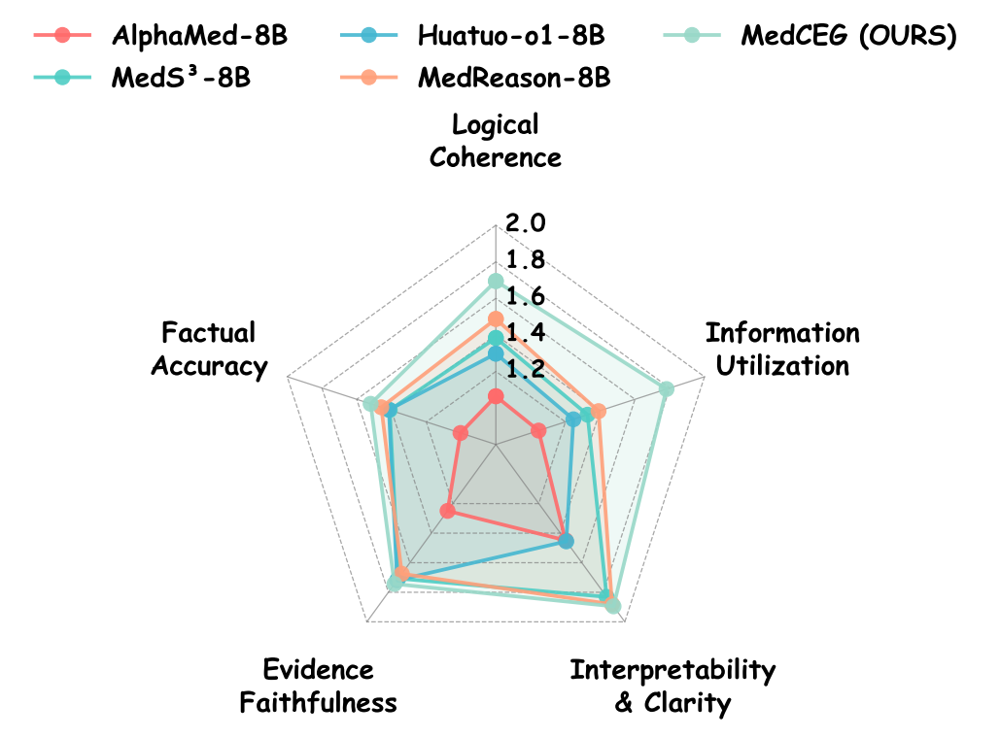

<div align="center">

# MedCEG: Reinforcing Verifiable Medical Reasoning with Critical Evidence Graph

[](https://huggingface.co/LinjieMu/MedCEG)
[](http://arxiv.org/abs/2512.13510)
[](./LICENSE)

**MedCEG** is a framework that augments medical language models with clinically valid reasoning pathways. It explicitly supervises the reasoning process through a **Critical Evidence Graph (CEG)**, ensuring verifiable and logical medical deductions.

[](images/pipeline.png)

</div>

## 📖 Table of Contents
- [MedCEG: Reinforcing Verifiable Medical Reasoning with Critical Evidence Graph](#medceg-reinforcing-verifiable-medical-reasoning-with-critical-evidence-graph)
  - [📖 Table of Contents](#-table-of-contents)
  - [🚀 Model Architecture \& Pipeline](#-model-architecture--pipeline)
  - [🛠️ Training with VeRL](#️-training-with-verl)
    - [1. Start the Embedding Service](#1-start-the-embedding-service)
    - [2. Integration with VeRL](#2-integration-with-verl)
  - [💻 Inference](#-inference)
  - [📊 Data Description](#-data-description)
  - [🏆 Experimental Results](#-experimental-results)
    - [Main Results](#main-results)
    - [Reasoning Process Quality](#reasoning-process-quality)
  - [📁 File Structure](#-file-structure)

---

## 🚀 Model Architecture & Pipeline

Our approach consists of two main stages designed to bridge the gap between structured knowledge and natural language reasoning:

1.  **🔥 Cold-Start**: We transform structured evidence graphs into natural language to teach the model logical dependencies and warm up the reasoning capabilities.
2.  **🕸️ Graph-guided Reinforcement Learning**: We utilize the **Critical Evidence Graph (CEG)** to provide dense, process-oriented rewards, guiding the model towards accurate diagnostic paths.

---

## 🛠️ Training with VeRL

We utilize [**VeRL**](https://github.com/volcengine/verl) (Volcengine Reinforcement Learning) for the RLHF/RLAIF stage. Our custom **Process Reward** functions are located in the `code/reward` directory.

### 1. Start the Embedding Service

To ensure efficient semantic similarity calculation during training (avoiding repeated model reloading), we deploy a standalone **FastAPI** server. This server manages a pool of `BGE-LARGE-EN-V1.5` models across available GPUs.

**Setup:**
Update the `BGE_PATH` variable in `code/server/EmbeddingServer.py` to point to your local model path.

**Launch:**
```bash
python code/server/EmbeddingServer.py
```
> **Note:** Ensure this server is accessible to your training nodes (default port `8000`).

### 2. Integration with VeRL

The files in `code/reward/` implement the custom reward logic tailored for MedCEG:

* **`GraphReward.py`**: The core logic for calculating the composite reward, consisting of:
    * *Node Coverage*
    * *Structural Correctness*
    * *Chain Completeness*
* **`GraphMCQ.py`** & **`GraphOpenendQuestion.py`**: These scripts expose the `compute_score()` function, serving as the primary interface for the reward model for different question types.

**The Reward Function evaluates three dimensions:**
1.  **📝 Format Reward**: Verifies proper usage of `<think>...</think>` tags.
2.  **🎯 Accuracy Reward**: Validates the final answer against Ground Truth.
3.  **🧠 Process Reward**: Extracts the reasoning graph from the `<think>` trace and compares it against the Ground Truth CEG using the Embedding Server.

---

## 💻 Inference

The `Inference.py` script demonstrates how to generate responses using MedCEG. Our model weights are available on [HuggingFace](https://huggingface.co/LinjieMu/MedCEG).

```python
import transformers
import torch

# 1. Load Model & Tokenizer
model_id = "XXX/MedCEG"
tokenizer = transformers.AutoTokenizer.from_pretrained(model_id)
model = transformers.AutoModelForCausalLM.from_pretrained(
    model_id,
    torch_dtype=torch.bfloat16,
    device_map="auto",
)

# 2. Define Input
question = "A 78-year-old Caucasian woman presented with..."
suffix = "\nPut your final answer in \\boxed{}."
messages = [{"role": "user", "content": question + suffix}]

# 3. Generate
input_ids = tokenizer.apply_chat_template(
    messages, 
    add_generation_prompt=True, 
    return_tensors="pt"
).to(model.device)

outputs = model.generate(input_ids, max_new_tokens=8196, do_sample=False)
decoded_response = tokenizer.decode(outputs[0][input_ids.shape[-1]:], skip_special_tokens=True)

print(decoded_response)
```

---

## 📊 Data Description

`DataExample.jsonl` contains samples of our constructed training data. Key fields include:

| Key | Description |
| :--- | :--- |
| `question` | The input clinical question. |
| `answer` | The ground truth answer. |
| `reasoning_content` | The rewritten "thinking" process, aligned with the CEG. |
| `graph/triplets` | The full Evidence Graph (EG). |
| `graph/core_reasoning_subgraph` | The **Critical Evidence Graph (CEG)** used for reward calculation. |

---

## 🏆 Experimental Results

### Main Results
MedCEG achieves state-of-the-art performance across multiple medical benchmarks, demonstrating significant improvements in both **accuracy** and **reasoning quality**.


> *Table 1: Comprehensive performance comparison across ID (In-Distribution) and OOD (Out-Of-Distribution) benchmarks.*

### Reasoning Process Quality
We evaluated the reasoning process across five dimensions: *Logical Coherence, Factual Accuracy, Evidence Faithfulness, Interpretability & Clarity, and Information Utilization*.

<div align="center">
  
</div>

> *Figure 2: Multi-dimensional evaluation showing MedCEG significantly outperforms baselines in producing clinically sound reasoning.*

---

## 📁 File Structure

```text
.
├── ReadMe.md
└── code
    ├── DataExample.jsonl         # Sample data structure
    ├── evaluation
    │   └── ProcessEvaluation.py  # Evaluate reasoning process precision
    ├── reward                    # Core Reward Logic for VeRL
    │   ├── graph_extract.py      # Extract triplets from reasoning text via LLM
    │   ├── GraphReward.py        # Calculate graph-based rewards (Node, Struct, Chain)
    │   ├── GraphMCQ.py           # Reward entry point for Multiple Choice Questions
    │   ├── GraphOpenendQuestion.py # Reward entry point for Open-ended Questions
    │   └── TripletsRecall.py     # Utility for calculating triplet recall
    └── server
        └── EmbeddingServer.py    # FastAPI server for BGE embeddings
```

<!-- ---

## 🖊️ Citation

If you find this work useful, please cite our paper:

```bibtex
@article{medceg2025,
  title={MedCEG: Reinforcing Verifiable Medical Reasoning with Critical Evidence Graph},
  author={Linjie Mu, Yannian Gu, Zhongzhen Huang, Yakun Zhu, Shaoting Zhang and Xiaofan Zhang},
  journal={arXiv preprint arXiv:2512.13510},
  year={2025}
}
``` -->